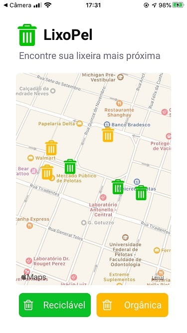
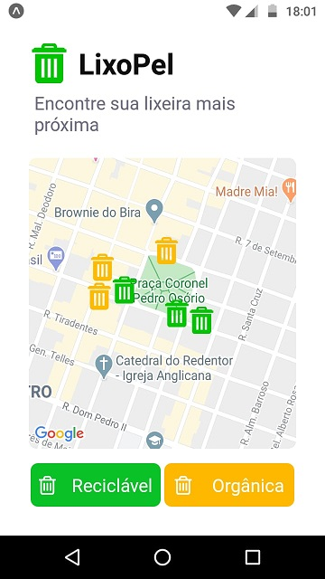

# LixoPel

Aplicativo e base de dados desenvolvidos para a semana do meio ambiente, cujo intuito é mostrar, utilizando a API de mapa, a localização de lixeiras recicláveis e orgânicas da cidade de Pelotas.

### Tecnologias Utilizadas
* React Native
* Expo
* Nodemon
* Express
* Axios
* Knex
* React Native Maps

### Introdução

Para testar a aplicação é necessário primeiramente realizar a instalação das dependências tanto para o mobile quanto para o backend, utilizando npm ou Yarn, como por exemplo, executando o comando "yarn". O projeto foi construido utilizando Yarn.

Para executar o backend basta navegar no seu terminal até a pasta backend e executar "yarn dev". Para rodar a aplicação mobile utiliza-se o comando "yarn start".

Para testar o app, tanto em um dispositivo físico quanto em um emulador, é necessário instalar o Expo, diretamente da loja de aplicativos.

### Funcionalidades

O aplicativo mostra, no mapa do seu sistema, localizações fake de lixeiras orgânica e recicláveis na cidade de Pelotas. É possível mostrar apenas um tipo de lixeira, desselecionando alguma das opções nos botões abaixo do mapa.
